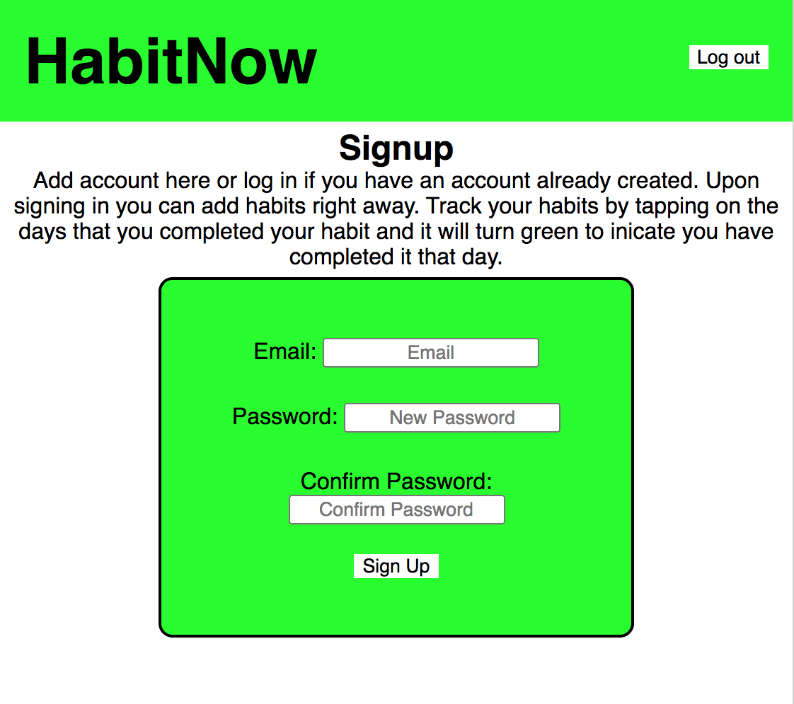

# Habit App

Building Habits one step at a time.

Live app: (https://habit-app-omega.vercel.app/)

## Table of Contents

- Summary of App
- Screenshots of App in Use
- Technologies Used

## Summary

HabitNow is a tool that users can use to build habits. There is no limit to the number of goals that they can add, each with an individual calendar. Users add a habit with the number of times per week they want to complete the habit and note about it. The habit is then added to the user's dashboard. Users track days by tapping the calendar of the day they have completed their habit. This is what establishes the routine of the habit.

### Screenshots

## Technologies Used

- Node.js (v. 12.18.3)
- React.js (v. 17.0.1)
- PostgreSQL (v. 12.4)
- Express (v. 4.17.1)
